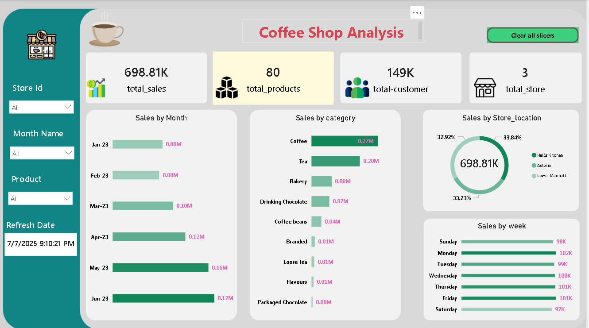

\# ☕ Coffee Shop Sales Analysis - Power BI Dashboard

This project presents an interactive Power BI dashboard analyzing sales data from a multi-store coffee shop between \*\*January to June 2023\*\*.

\## 📊 Dashboard Features

\### 🔹 Key KPIs

\- Total Sales: 698.81K

\- Total Customers: 149K

\- Total Products: 80

\- Total Stores: 3

\### 🔹 Insights:

\- Sales by Month: Peak in June (0.17M)

\- Top Categories: Coffee \& Tea

\- Store Sales: Even distribution across locations

\- Weekday Trends: Monday has the highest sales

\## 🛠 Tools Used

\- Power BI

\- DAX

\- Slicers, Donut Charts, KPI Cards

\- Interactive Filtering

\## 📁 Files

\- `pbix/Coffee\_Shop\_Analysis.pbix`

\- `assets/coffee\_shop\_dashboard.png`

\## 📬 Contact

Sandip Shrestha    

📧 psth117@gmail.com  

🔗 \[LinkedIn](h)

